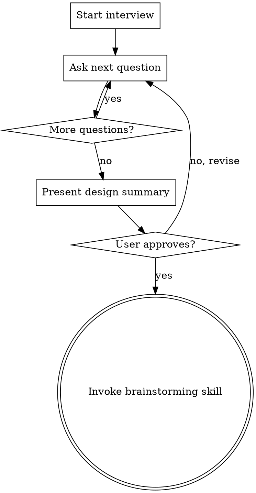

# new-app — Scaffold a New Django App

## Overview

Guided interview to design and scaffold a new `apps/<name>/` module for the Smart Admin template. Asks focused questions one at a time, then hands off to `superpowers:brainstorming` for full spec + plan.

**Core principle:** Never touch code until the interview is complete and the user approves the design summary.

## Process



## Interview Questions (one at a time, in order)

Ask each question and wait for the answer before proceeding.

**1. Nombre y propósito**
> "¿Cómo se llamará la app y en una frase, qué hace?"
> Ejemplo: `tasks` — gestión de tareas internas del equipo.

**2. Modelos principales**
> "¿Qué modelos necesita? Lista los nombres y los campos más importantes."
> Ejemplo: Task (título, estado, asignado_a, fecha_límite), Category (nombre, color).

**3. Features del template a usar**
> "¿Cuáles de estas features del template quieres integrar? (puedes elegir varias)"
> - `notifications` — notificar a usuarios cuando ocurre algo
> - `audit` — registrar cambios automáticamente con AuditMixin
> - `config` — parámetros configurables desde el admin (ConfigService)
> - `permissions` — roles y permisos granulares por objeto
> - Ninguna por ahora

**4. Acciones que disparan notificaciones** *(solo si eligió notifications)*
> "¿Qué eventos deben disparar notificaciones? ¿A quién y qué dice el mensaje?"
> Ejemplo: al asignar una task → notificación in-app al asignado.

**5. Vistas custom** *(fuera del admin)*
> "¿Necesita vistas propias fuera del admin de Unfold, o solo admin?"
> A) Solo admin de Unfold
> B) También vistas custom en `/nombre-app/`

**6. Diseño del admin**
> "¿Cómo quieres ver los datos en el admin? Por ejemplo:"
> - Lista con badges de estado/prioridad
> - Filtros por estado, asignado, fecha
> - Tabs en el change form
> - Acciones bulk (marcar como completado, reasignar)

**7. Tests**
> "¿Qué comportamientos son críticos de testear?"
> Ejemplo: que crear una task notifica al asignado, que solo el asignado puede editar.

## Design Summary Format

Después de completar el interview, presenta el resumen así:

```
## Resumen de diseño — apps/<name>/

**Propósito:** ...

**Modelos:**
- ModelA: campos...
- ModelB: campos...

**Integraciones:**
- notifications: evento → destinatario → mensaje
- audit: modelos auditados
- config: claves que se crearán
- permissions: roles con acceso

**Admin:** descripción del UX (badges, filtros, tabs, acciones)

**Vistas custom:** sí/no + paths

**Tests críticos:** lista

¿Apruebas este diseño o ajustamos algo?
```

## After Approval

**REQUIRED:** Invoke `superpowers:brainstorming` passing the approved design summary as context. The brainstorming skill will create the full spec and implementation plan.

## Rules

- **One question at a time.** Never ask two questions in the same message.
- **No code before approval.** The interview produces a design summary, not code.
- **Skip irrelevant questions.** If the user says "solo admin", skip question 5.
- **UI questions use the solid-platform-design skill** for Unfold component guidance when designing the admin layout.
- **All new ModelAdmin must inherit from `unfold.admin.ModelAdmin`.**
- **All UI strings in `_()` or ``.**
- **Service pattern for business logic** — no logic in views or admin, only in `*Service` classes.
