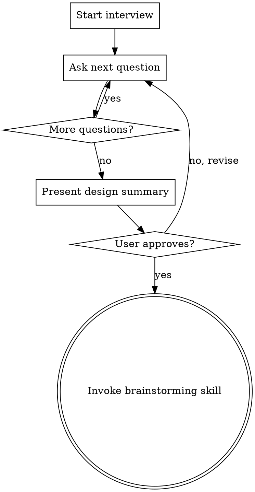

# new-app — Scaffold a New Django App

## Overview

Guided interview to design and scaffold a new `apps/<name>/` module for the Smart Admin template. Asks focused questions one at a time, then hands off to `superpowers:brainstorming` for full spec + plan.

**Core principle:** Never touch code until the interview is complete and the user approves the design summary.

## Process



## Interview Questions (one at a time, in order)

**1. Nombre y propósito**
> "¿Cómo se llamará la app y en una frase, qué hace?"
> Ejemplo: `tasks` — gestión de tareas internas del equipo.

**2. Modelos principales**
> "¿Qué modelos necesita? Lista los nombres y los campos más importantes."
> Ejemplo: Task (título, estado, asignado_a, fecha_límite), Category (nombre, color).

**3. Features del template a usar**
> "¿Cuáles de estas features del template quieres integrar?"
> - `notifications` — notificar usuarios con `NotificationService.send()`
> - `audit` — registrar cambios automáticamente con `AuditMixin`
> - `config` — parámetros configurables con `ConfigService.get()`
> - `permissions` — roles y permisos granulares por objeto
> - Ninguna por ahora

**4. Notificaciones** *(solo si eligió notifications)*
> "¿Qué eventos disparan notificaciones, a quién y por qué canal?"
> Ejemplo: al asignar una task → `in_app` al asignado: "Te asignaron: {título}".

**5. Config keys** *(solo si eligió config)*
> "¿Qué parámetros necesita configurar el admin sin tocar código?"
> Ejemplo: `tasks_max_per_user` (int, default 20).
> Estos se crearán en un data migration `000X_default_config.py`.

**6. Señales vs Service**
> "¿Hay lógica que deba ejecutarse automáticamente al guardar/crear/eliminar un modelo?"
> - Sí → va en `signals.py`
> - No → toda la lógica va en `<App>Service` en `services.py`

**7. Vistas custom**
> "¿Necesita vistas propias fuera del admin de Unfold, o solo admin?"
> A) Solo admin de Unfold
> B) También vistas en `/<app-name>/`

**8. Diseño del admin**
> "¿Cómo quieres ver los datos en el admin?"
>
> Unfold soporta nativamente — menciona cuáles quieres:
> - Badges de estado/prioridad con colores (`@display(label={...})`)
> - `compressed_fields = True` para listas densas
> - `warn_unsaved_change = True` (siempre activo en este template)
> - Tabs en el change form (`"classes": ["tab"]` en fieldsets)
> - Bulk actions (`@action(description=...)`)
> - `date_hierarchy` para navegación por fecha

**9. Dashboard widget**
> "¿Quieres un widget de esta app en el dashboard principal (`/admin/`)?"
> Ejemplo: stat card con tasks pendientes, o tabla con tasks urgentes.

**10. Tests críticos**
> "¿Qué comportamientos son imprescindibles de testear?"
> Categorías: Model, Service, Admin, Signal (si aplica).
> Ejemplo: "que crear una task con asignado dispara notificación in-app".

---

## Known Pitfalls (include in spec and plan)

Document these explicitly when invoking brainstorming — they caused real bugs in this project:

**Unfold CSS — NO Tailwind utilities**
Unfold compiles its own CSS. Standard Tailwind classes like `bg-gray-100`, `sm:grid-cols-3`, `text-blue-600` are NOT available in templates. Use:
- Inline `style=""` for layout (grids, spacing)
- Unfold native components: ``, `chart/bar`, `table`, `title`, `text`, `flex`
- Unfold CSS variables: `bg-base-900`, `text-font-important-light`, `dark:bg-base-800`

**Unfold `table` component expects a Python object**
Do NOT pass raw HTML inside ``.
Pass `table=my_table` where `my_table` has `.headers` (list of strings) and `.rows` (list of lists).
Reuse the `_Table` helper from `apps/core/dashboard.py`.

**Unfold `chart/bar` expects Chart.js JSON**
Pass `data=chart_data` where `chart_data` is `json.dumps({labels: [...], datasets: [...]})`.
Unfold includes Chart.js — do NOT add a CDN script tag.

**URLs under `/admin/` must be registered BEFORE `admin.site.urls`**
Django's admin URL pattern consumes all of `/admin/`. Any custom URL under that prefix must appear before `path("admin/", admin.site.urls)` in `config/urls.py`.

**Admin views require `@staff_member_required`**
Not `@login_required`. Views under `/admin/` must check `is_staff=True`.
In tests, create users with `is_staff=True` or the client will get 302.

**Dashboard imports must be inside the function body**
To avoid circular imports, always import models from other apps inside `dashboard_callback()`:
```python
def dashboard_callback(request, context):
    from apps.myapp.models import MyModel  # inside function, not at top of file
    ...
```

---

## Design Summary Format

```
## Resumen de diseño — apps/<name>/

**Propósito:** ...

**Modelos:**
- ModelA: campos y tipos
- ModelB: campos y tipos

**Integraciones:**
- notifications: evento → canal → destinatario → mensaje
- audit: modelos con AuditMixin
- config: clave (tipo, default) — descripción
- permissions: roles con acceso

**Señales:** sí/no — qué eventos en signals.py

**Admin:**
- Lista: columnas, badges con colores, filtros, date_hierarchy
- Change form: tabs (fieldsets con "classes": ["tab"]), warn_unsaved_change=True
- Bulk actions: descripción

**Dashboard widget:** sí/no — stat card o tabla (_Table helper)

**Sidebar:** sección en UNFOLD["SIDEBAR"] — título, icono (Material Symbols)

**LOCAL_APPS:** agregar "apps.<name>" en config/settings/base.py

**URLs:** sí/no — registrar ANTES de admin.site.urls en config/urls.py

**Data migrations:** sí/no — config keys iniciales

**Tests críticos:**
- Model: ...
- Service: ...
- Admin: ...
- Signal: ... (si aplica)

¿Apruebas este diseño o ajustamos algo?
```

---

## After Approval

**REQUIRED:** Invoke `superpowers:brainstorming` with the approved design summary as context. Include the Known Pitfalls section so the implementation plan addresses them explicitly.

---

## Coding Rules (always apply)

- Code (variables, functions, classes, comments) in **English**
- UI strings in **Spanish** wrapped in `_()` or ``
- All `ModelAdmin` inherit from `unfold.admin.ModelAdmin`
- Business logic only in `*Service` classes — never in views or admin
- `AppConfig` with `default_auto_field = "django.db.models.BigAutoField"` in `apps.py`
- Translations in `locale/es/` and `locale/en/` (project root)
