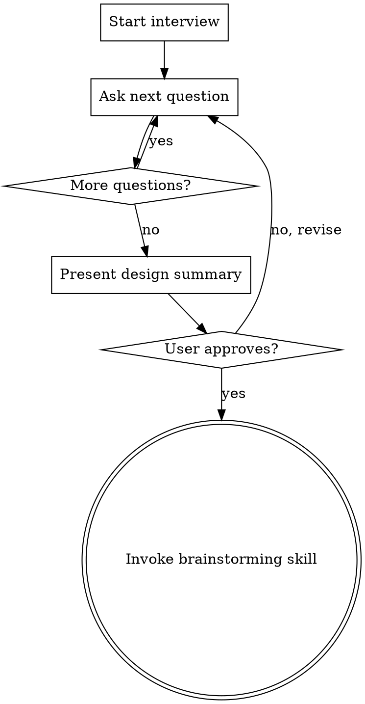

# new-app — Scaffold a New Django App

## Overview

Guided interview to design and scaffold a new `apps/<name>/` module for the Smart Admin template. Asks focused questions one at a time, then hands off to `superpowers:brainstorming` for full spec + plan.

**Core principle:** Never touch code until the interview is complete and the user approves the design summary.

## Process



## Interview Questions (one at a time, in order)

Ask each question and wait for the answer before proceeding.

**1. Nombre y propósito**
> "¿Cómo se llamará la app y en una frase, qué hace?"
> Ejemplo: `tasks` — gestión de tareas internas del equipo.

**2. Modelos principales**
> "¿Qué modelos necesita? Lista los nombres y los campos más importantes."
> Ejemplo: Task (título, estado, asignado_a, fecha_límite), Category (nombre, color).

**3. Features del template a usar**
> "¿Cuáles de estas features del template quieres integrar? (puedes elegir varias)"
> - `notifications` — notificar usuarios con `NotificationService.send()`
> - `audit` — registrar cambios automáticamente con `AuditMixin` en el ModelAdmin
> - `config` — parámetros configurables con `ConfigService.get()` / `ConfigService.set()`
> - `permissions` — roles y permisos granulares por objeto
> - Ninguna por ahora

**4. Notificaciones** *(solo si eligió notifications)*
> "¿Qué eventos disparan notificaciones, a quién y qué dice el mensaje?"
> Ejemplo: al asignar una task → in-app al asignado: "Te asignaron la task: {título}".

**5. Config keys** *(solo si eligió config)*
> "¿Qué parámetros necesita configurar el admin sin tocar código?"
> Ejemplo: `tasks_max_per_user` (int, default 20) — límite de tasks activas por usuario.
> Estos se crearán en un data migration `000X_default_config.py`.

**6. Señales vs Service**
> "¿Hay lógica que deba ejecutarse automáticamente al guardar/crear/eliminar un modelo?"
> - Sí → va en `signals.py` (ej: enviar notificación al guardar)
> - No → toda la lógica va en `<App>Service` en `services.py`
> Regla: lógica de negocio solo en `*Service`, nunca en vistas o admin.

**7. Vistas custom** *(fuera del admin)*
> "¿Necesita vistas propias fuera del admin de Unfold, o solo admin?"
> A) Solo admin de Unfold
> B) También vistas en `/<app-name>/` — especifica qué páginas

**8. Diseño del admin**
> "¿Cómo quieres ver los datos en el admin?"
>
> Unfold soporta nativamente:
> - `list_display` con `@display(label={...})` para badges de estado/prioridad con colores
> - `compressed_fields = True` para listas densas
> - `warn_unsaved_change = True` en todos los ModelAdmin
> - `fieldsets` con `"classes": ["tab"]` para tabs en el change form
> - `actions = [...]` con `@action(description=...)` para bulk actions
> - `date_hierarchy` para navegación por fecha
>
> Describe qué quieres ver en la lista y en el formulario de edición.

**9. Dashboard widget**
> "¿Quieres un widget de esta app en el dashboard principal (`/admin/`)?"
> Ejemplo: "Mis tasks pendientes hoy" como stat card, o lista de tasks urgentes.
> Esto se agrega a `apps/core/dashboard.py`.

**10. Tests críticos**
> "¿Qué comportamientos son imprescindibles de testear?"
>
> Piensa en estas categorías:
> - **Model tests** — validaciones, métodos, `__str__`
> - **Service tests** — lógica de negocio, que las notificaciones se disparan
> - **Admin tests** — que el ModelAdmin está registrado, que las bulk actions funcionan
> - **Signal tests** — que las señales se ejecutan correctamente *(si aplica)*
>
> Ejemplo: "que crear una task con asignado dispara notificación in-app".

## Design Summary Format

Después del interview, presenta el resumen completo:

```
## Resumen de diseño — apps/<name>/

**Propósito:** ...

**Modelos:**
- ModelA: campos y tipos
- ModelB: campos y tipos

**Integraciones:**
- notifications: evento → canal → destinatario → mensaje
- audit: modelos con AuditMixin
- config: clave (tipo, default) — descripción
- permissions: roles con acceso

**Señales:** sí/no — qué eventos

**Admin:**
- Lista: columnas con badges, filtros, date_hierarchy, compressed_fields
- Change form: fieldsets con tabs, warn_unsaved_change
- Bulk actions: descripción

**Dashboard widget:** sí/no — descripción del widget

**Sidebar:** entrada en UNFOLD["SIDEBAR"] bajo sección "..." con icono "..."

**Vistas custom:** sí/no — paths

**Data migrations:** sí/no — claves de config iniciales

**Tests críticos:**
- Model: ...
- Service: ...
- Admin: ...
- Signal: ... (si aplica)

¿Apruebas este diseño o ajustamos algo?
```

## After Approval

**REQUIRED:** Invoke `superpowers:brainstorming` passing the approved design summary as context. The brainstorming skill will create the full spec and implementation plan.

## Rules

- **One question at a time.** Never ask two questions in the same message.
- **No code before approval.** The interview produces a design summary, not code.
- **Skip irrelevant questions.** Si eligió "solo admin" en pregunta 7, no hay vistas custom. Si no eligió config, saltar pregunta 5.
- **Toda nueva app debe agregarse a `LOCAL_APPS` en `config/settings/base.py`** — indicarlo en el resumen.
- **Toda nueva app debe aparecer en `UNFOLD["SIDEBAR"]`** — preguntar bajo qué sección y con qué icono (Material Symbols).
- **Todo ModelAdmin hereda de `unfold.admin.ModelAdmin`.**
- **Todo string de UI en `_()` o ``.**
- **Lógica de negocio solo en clases `*Service`**, nunca en vistas o admin.
- **`AppConfig` con `default_auto_field = "django.db.models.BigAutoField"`** en `apps.py`.
