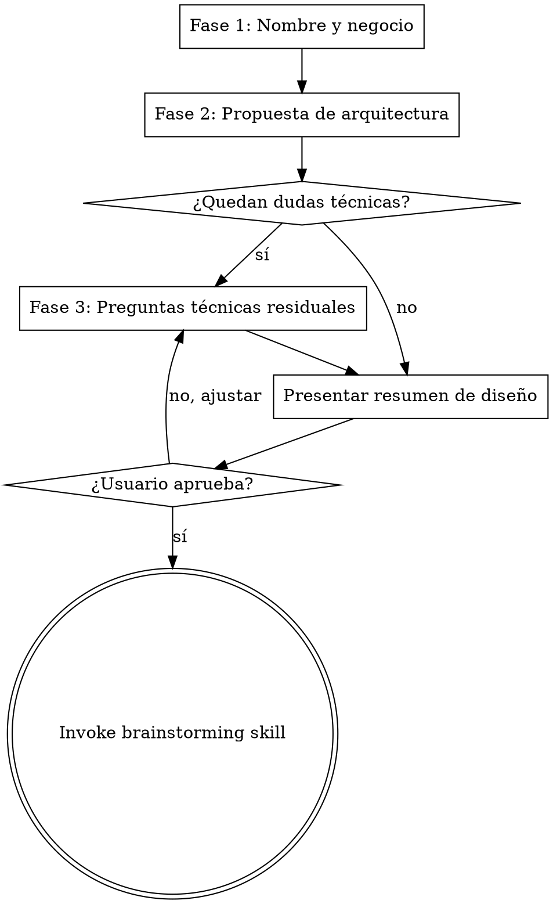

# new-app — Scaffold a New Django App

## Overview

Entrevista guiada para diseñar y scaffoldear un nuevo módulo `apps/<name>/` en el Smart Admin template. Parte del negocio y los objetivos, propone una arquitectura completa, y luego entrega a `superpowers:brainstorming` para spec + plan detallado.

**Principio rector:** Nunca tocar código hasta que la entrevista esté completa y el usuario apruebe el resumen de diseño. Una pregunta a la vez.

## Process



---

## Fase 1 — Nombre y negocio (3 preguntas fijas, una a la vez)

**Pregunta 1 — Nombre**
> "¿Cómo se llamará la app?"
> Ejemplo: `tasks`, `invoices`, `crm`.

**Pregunta 2 — Propósito y audiencia**
> "¿Qué problema resuelve y para quién? ¿Quién la usa: admin interno, staff operativo, usuarios finales?"
> Ejemplo: "gestión de tareas internas — la usa el equipo de operaciones para asignar y hacer seguimiento de trabajo diario".

**Pregunta 3 — Flujo principal**
> "¿Cuál es el flujo principal? Descríbelo como pasos: qué hace el usuario desde que entra hasta que termina."
> Ejemplo: "el supervisor crea una tarea, la asigna a un operador, el operador la marca como completada, el supervisor la aprueba".

---

## Fase 2 — Propuesta de arquitectura

Con las 3 respuestas anteriores, **proponer** una arquitectura completa antes de hacer más preguntas. La propuesta incluye:

- **Modelos inferidos** — nombres, campos principales, relaciones
- **Integraciones del template inferidas** — cuáles de `notifications`, `audit`, `config`, `permissions` aplican y por qué
- **Componentes UI sugeridos** — qué componentes custom del proyecto usaría (ver catálogo abajo)
- **Vistas custom** — si el flujo requiere páginas fuera del admin de Unfold
- **Dashboard widget** — si hay KPIs naturales para mostrar en `/admin/`
- **Señales vs Services** — qué lógica va dónde, según el criterio establecido

Formato de la propuesta:
```
Con esto veo que `<name>` necesitaría:

**Modelos:** TaskA (campo1, campo2), ModelB (campo1) relacionado con TaskA via FK.

**Integraciones:**
- `notifications` — al ocurrir X → notificar a Y por canal Z
- `audit` — registrar cambios en ModelA con AuditMixin
- *(config y permissions no parecen necesarios aquí — ¿confirmas?)*

**UI:**
- Lista en admin con badges de estado + filtros por fecha
- Split panel para ver detalle sin salir de la lista
- Stat card en dashboard con total de tasks pendientes
- Inline edit para cambiar estado directamente desde la lista

**Vistas custom:** sí/no — [razón]

¿Esto se alinea con lo que tienes en mente, o ajustamos algo antes de continuar?
```

---

## Fase 3 — Preguntas técnicas residuales

Solo preguntar lo que **no se pudo inferir** del contexto de negocio. Ejemplos de preguntas que pueden o no ser necesarias según la propuesta:

**Señales vs Service** *(si hay lógica post-save ambigua)*
> "Para [evento X], ¿debe ocurrir siempre sin excepción (señal) o solo cuando el código lo llame explícitamente (service)?"
>
> | Situación | Usa |
> |-----------|-----|
> | Debe ocurrir **siempre**, en cualquier contexto (admin, API, shell, migration) | `signals.py` |
> | Tiene condiciones o solo ocurre cuando el código lo llama | `services.py` |
>
> Regla por defecto: preferir Services. Las señales se disparan en fixtures y migrations de forma inesperada.

**Config keys** *(si se propuso integración config)*
> "¿Qué parámetros necesita configurar el admin sin tocar código?"
> Ejemplo: `tasks_max_per_user` (int, default 20). Se crean en data migration `000X_default_config.py`.

**Tests críticos** *(siempre preguntar si no quedó claro del flujo)*
> "¿Qué comportamientos son imprescindibles de testear?"
> Ejemplo: "que crear una task con asignado dispara notificación in-app".

---

## Catálogo de componentes custom del proyecto

Al proponer UI en Fase 2, elegir de esta lista. No inventar HTML manual si existe un componente equivalente.

| Componente | Cuándo usarlo |
|------------|---------------|
| `toast.html` | Feedback de acciones HTMX (guardar, aprobar, rechazar) |
| `confirm_dialog.html` | Confirmación antes de acción destructiva — modo simple o estricto (escribir texto) |
| `data_list.html` | Mostrar campos etiqueta/valor de un objeto en detalle o modal |
| `empty_state.html` | Estado vacío de listas, tablas o paneles |
| `skeleton.html` | Placeholder de carga mientras HTMX espera |
| `page_header.html` | Cabecera de página con título, subtítulo, breadcrumbs y botones de acción |
| `filter_tabs.html` | Tabs de filtro con contadores async — ideal para listas con estados |
| `stat_card.html` | KPI en dashboard — valor, ícono, tendencia |
| `inline_edit.html` | Editar un campo sin abrir el change form (click-to-edit, HTMX PATCH) |
| `modal_content.html` | Shell para modales HTMX — tamaño sm/md/lg/xl |
| `split_panel.html` | Master-detail: lista izquierda, detalle HTMX derecho |
| `copy_to_clipboard.html` | Mostrar ID, token o URL con botón de copia |

Referencia completa de parámetros: `docs/ui-components.md`

---

## Known Pitfalls (incluir siempre en el contexto para brainstorming)

**Unfold CSS — NO Tailwind utilities**
Unfold compila su propio CSS. Clases estándar como `bg-gray-100`, `sm:grid-cols-3`, `text-blue-600` NO están disponibles. Usar:
- `style=""` inline para layout
- Componentes Unfold nativos: `card.html`, `table.html`, `flex.html`
- Variables CSS de Unfold: `bg-base-900`, `dark:bg-base-800`
- Componentes custom del proyecto (catálogo arriba)

**Unfold `table` component expects a Python object**
No pasar HTML dentro de ``.
Pasar `table=my_table` donde `my_table` tiene `.headers` (list) y `.rows` (list of lists).
Reutilizar el helper `_Table` de `apps/core/dashboard.py`.

**Unfold `chart/bar` expects Chart.js JSON**
Pasar `data=chart_data` donde `chart_data = json.dumps({labels: [...], datasets: [...]})`.
Unfold incluye Chart.js — NO agregar CDN script tag.

**URLs se declaran en `AppConfig`, no en `config/urls.py`**
```python
plugin_urls = [
    {"prefix": "admin/mi-app/", "urlconf": "apps.mi_app.urls"},
]
```
El motor `config/plugins.py` las registra automáticamente. Nunca tocar `config/urls.py`.

**Admin views require `@staff_member_required`**
No `@login_required`. Vistas bajo `/admin/` deben verificar `is_staff=True`.
En tests, crear usuarios con `is_staff=True` o el cliente recibirá 302.

**Dashboard imports must be inside the function body**
Para evitar imports circulares, siempre importar modelos de otras apps dentro de `dashboard_callback()`:
```python
def dashboard_callback(request, context):
    from apps.myapp.models import MyModel  # dentro de la función, no en el top del archivo
```

**Toast vs Django messages**
- Acción HTMX sin redirect → Toast (`response["HX-Trigger"] = json.dumps({"showToast": {...}})`)
- Formulario con redirect → ``

**Inline Edit endpoint**
Debe recibir PATCH y retornar el componente completo — Unfold hace `outerHTML` swap para reinicializar Alpine.

**Docstrings en componentes custom — NO usar `` dentro de `{# #}` ni `<!-- -->`**
Django parsea `` incluso dentro de comentarios `{# #}` multilínea Y dentro de `<!-- -->`.
Los docstrings de los componentes en `templates/unfold/components/` deben usar `[component]` / `[endcomponent]`
como texto plano en los ejemplos de uso, nunca la sintaxis real ``.
```html
<!-- Uso:
  [component "unfold/components/stat_card.html" with title="KPI" value=42]
  [endcomponent]
-->
```

**`...` con slot content falla dentro de ``**
Si el contenido entre `` y `` tiene tags Django (como ``,
``, ``), el parser falla al estar dentro de un `` heredado.
Solución: renderizar ese fragmento como HTML inline (sin usar el componente con slot content).
Los componentes sin slot content (``) sí funcionan.

**Modal con Alpine + HTMX — usar `x-show` no `x-template x-if`**
`<template x-if>` no renderiza el DOM hasta que la condición es true, por lo que HTMX no puede
escribir en un elemento dentro de él. Siempre usar `x-show` + `x-cloak` para modales HTMX:
```html
<div x-data="{ openModal: false }" x-on:open-modal.window="openModal = true" x-on:close-modal.window="openModal = false">
  <div x-show="openModal" x-cloak style="position:fixed;inset:0;z-index:50;background:rgba(0,0,0,0.5);display:flex;align-items:center;justify-content:center"
       x-on:click.self="openModal = false">
    <div id="modal-body"></div>
  </div>
</div>
```
Y definir `[x-cloak]{display:none!important}` en `<style>` del ``.

**Cerrar modal tras acción HTMX exitosa (204)**
Con respuesta 204 no hay body para swapear, así que `hx-swap` no cierra el modal.
Disparar cierre via evento en el listener JS del HX-Trigger:
```javascript
document.addEventListener("refreshContacts", function() {
  htmx.trigger("#lista", "refresh-list");
  window.dispatchEvent(new CustomEvent("close-modal"));
});
```

**`hx-on::after-request` — sintaxis correcta**
La sintaxis correcta en HTMX para eventos del ciclo de vida es:
`hx-on:htmx:after-request="..."` (no `hx-on::after-request`).

**IntegrityError en Services — siempre capturar**
`Model.objects.create()` puede lanzar `IntegrityError` (ej: unique constraint en email).
Capturarlo en el Service y convertirlo a `ValueError` para que la vista lo maneje como error de form:
```python
from django.db import IntegrityError
try:
    obj = Model.objects.create(...)
except IntegrityError:
    raise ValueError(_("Ya existe un registro con ese valor."))
```

**Inputs de forms Django sin estilos en modales**
`{{ field }}` renderiza widgets sin CSS. Agregar clases Unfold en la definición del widget:
```python
widget=django_forms.TextInput(attrs={
    "class": "w-full border border-base-300 dark:border-base-600 rounded-default px-3 py-2 text-sm "
             "bg-white dark:bg-base-800 text-gray-900 dark:text-white "
             "focus:outline-none focus:ring-2 focus:ring-primary-500"
})
```

---

## Design Summary Format

```
## Resumen de diseño — apps/<name>/

**Propósito:** [una frase — para quién y qué problema resuelve]

**Modelos:**
- ModelA: campos y tipos
- ModelB: campos y tipos, FK a ModelA

**Integraciones:**
- notifications: evento → canal → destinatario → mensaje
- audit: modelos con AuditMixin
- config: clave (tipo, default) — descripción
- permissions: roles con acceso

**Señales:** sí/no — qué eventos en signals.py y por qué (no inferible del flujo)

**Services:** lógica de negocio en TaskService / [NombreService]

**Admin:**
- Lista: columnas, badges con colores, filtros, date_hierarchy
- Change form: tabs (fieldsets con "classes": ["tab"]), warn_unsaved_change=True
- Bulk actions: descripción

**UI custom:**
- Componentes del proyecto a usar: [lista]
- Vistas propias fuera del admin: sí/no — [descripción]

**Dashboard widget:** sí/no — stat card o tabla (_Table helper)

**Sidebar:** sección en UNFOLD["SIDEBAR"] — título, ícono (Material Symbols)

**LOCAL_APPS:** agregar "apps.<name>" en config/settings/base.py

**Plugin contract** (declarar siempre en `AppConfig`, aunque estén vacíos):
- `plugin_urls`: rutas propias — se registran automáticamente antes de `admin.site.urls`
- `plugin_middleware`: middleware propio con `insert_after`
- `plugin_settings`: settings leídos de env vars

**Data migrations:** sí/no — config keys iniciales

**Tests críticos:**
- Model: ...
- Service: ...
- Admin: ...
- Signal: ... (si aplica)

¿Apruebas este diseño o ajustamos algo?
```

---

## After Approval

**REQUIRED:** Invocar `superpowers:brainstorming` con el resumen aprobado como contexto. Incluir la sección Known Pitfalls para que el plan de implementación los contemple explícitamente.

---

## Coding Rules (always apply)

- Código (variables, funciones, clases, comentarios) en **inglés**
- Strings de UI en **español** envueltos en `_()` o ``
- Todo `ModelAdmin` hereda de `unfold.admin.ModelAdmin`
- Lógica de negocio solo en clases `*Service` — nunca en vistas o admin
- `AppConfig` con `default_auto_field = "django.db.models.BigAutoField"` en `apps.py`
- Declarar siempre `plugin_urls = []`, `plugin_middleware = []`, `plugin_settings = {}` en el `AppConfig`
- Traducciones en `locale/es/` y `locale/en/` (raíz del proyecto)
